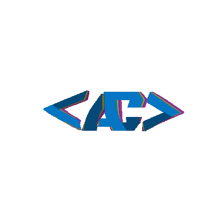

<article class="markdown-body entry-content container-lg f5" itemprop="text">
  <div class="markdown-heading" dir="auto">
    <h3 class="heading-element" dir="auto">Hi, I'm Carlewis 👋</h3>
  </div>

  ```
  ██████╗ █████╗ ██████╗  ██╗     ███████╗ ██╗           ██╗████████╗███████╗
  ██╔═══╝██╔══██╗██╔══██╗ ██║     ██╔════╝ ██║    ██╗    ██║╚══██╔══╝██╔════╝
  ██║    ███████║██████╔╝ ██║     █████╗   ╚██╗  ████╗  ██╔╝   ██║   ███████╗
  ██║    ██╔══██║██╔══██╗ ██║     ██╔══╝    ╚██╗██║╚██╗██╔╝    ██║   ╚════██║
  ██████╗██║  ██║██║  ╚██╗███████╗███████╗   ╚███╔╝ ╚███╔╝  ████████╗███████║
  ╚═════╝╚═╝  ╚═╝╚═╝   ╚═╝╚══════╝╚══════╝    ╚══╝   ╚══╝   ╚═══════╝╚══════╝
  ```

<p dir="auto">Are you looking for a Full-Stack development and QA Engineer skilled in automation?

Do you want to ensure the highest quality ✨ for your software products?

I’m a <strong>Full-Stack Developer (Web & Mobile)</strong> with experience building end-to-end applications and a strong background in <strong>QA Automation</strong>.

I design and develop scalable web applications using <strong>Laravel</strong>, <strong>React</strong>, and <strong>Vue</strong>, covering everything from backend APIs to responsive user interfaces. I’ve worked on real-world projects including an AI-powered restaurant ordering system, a B2B marketplace, and custom web platforms, focusing on performance, usability, and clean architecture.

Alongside development, I bring a solid testing mindset. I implement <strong>automated testing</strong> using <strong>Cypress</strong>, <strong>Playwright</strong>, <strong>Selenium</strong>, and <strong>Cucumber</strong>, ensuring applications are reliable, maintainable, and production-ready.

I also develop <strong>mobile applications</strong> using <b>React Native</b>, with several ongoing projects and working demos focused on real-world use cases and API integration.
  </p>
  <table border="0">
 <tr>
    <td>  
      <ul dir="auto">
        <li>💹 Programmer.</li>
        <li>🔭 Developing cross-platform mobile applications</li>
        <li>🌱 Expanding expertise in QA Automation and Test Engineering</li>
        <li>👯 I’m looking to collaborate on new business ideas.</li>
        <li>♨️Pain is inevitable but suffering is optional.</li>
        <li>✴️Hustle against odd.</li>
        <li>🤝 Open to collaborating on innovative software projects and business ideas</li>
      </ul>
    </td>
    <td>
      <div align="center">
        
      </div>  
    </td>
 </tr>
</table>

  <ul dir="auto">
    <li>💬 Ask me about life advice🤣🤣 , tech solution 👩‍💻 , traveling <g-emoji class="g-emoji" alias="airplane">✈️</g-emoji>, food 🌯 🫔 🥗 🥘 🫕 🥫 🍝 🍜 🍲 🍛.</li>
    <li>📫 How to reach me:DM 📱 <a href="mailto:acarlewis@gmail.com">acarlewis@gmail.com</a>.</li>
  </ul>
  <div class="markdown-heading" dir="auto">
    <h2 class="heading-element" dir="auto">🤝 Connect with me:</h2>
    <p dir="auto">Feel free to reach out if you'd like to discuss software development, QA automation, technology, entrepreneurship, or potential collaborations.</p>
    <a id="user-content--connect-with-me" class="anchor" aria-label="Permalink: 🤝 Connect with me:" href="#-connect-with-me">
      <svg class="octicon octicon-link" viewBox="0 0 16 16" version="1.1" width="16" height="16" aria-hidden="true">
        <path d="m7.775 3.275 1.25-1.25a3.5 3.5 0 1 1 4.95 4.95l-2.5 2.5a3.5 3.5 0 0 1-4.95 0 .751.751 0 0 1 .018-1.042.751.751 0 0 1 1.042-.018 1.998 1.998 0 0 0 2.83 0l2.5-2.5a2.002 2.002 0 0 0-2.83-2.83l-1.25 1.25a.751.751 0 0 1-1.042-.018.751.751 0 0 1-.018-1.042Zm-4.69 9.64a1.998 1.998 0 0 0 2.83 0l1.25-1.25a.751.751 0 0 1 1.042.018.751.751 0 0 1 .018 1.042l-1.25 1.25a3.5 3.5 0 1 1-4.95-4.95l2.5-2.5a3.5 3.5 0 0 1 4.95 0 .751.751 0 0 1-.018 1.042.751.751 0 0 1-1.042.018 1.998 1.998 0 0 0-2.83 0l-2.5 2.5a1.998 1.998 0 0 0 0 2.83Z"></path>
      </svg>
    </a>
  </div>
  <p dir="auto">
    <a href="https://www.linkedin.com/in/carlewis-akana-2226341b7/" rel="nofollow">
      
    </a>
  </p>
  <p dir="auto">
    <a href="https://instagram.com/a_carlewis" rel="nofollow">
      
    </a>
  </p>
  <p dir="auto">
    <a href="https://www.facebook.com/carlewis-akana" rel="nofollow">
      
    </a>
  </p>
  <p dir="auto">
    <a href="https://www.youtube.com/channel/carlewis2163" rel="nofollow">
      
    </a>
  </p>
  <p dir="auto">
    <a href="https://twitter.com/CarlewisAkana" rel="nofollow">
      
    </a>
  </p>
  <p dir="auto">
    <a href="https://www.sololearn.com/en/Profile/9491560" rel="nofollow">
      
    </a>
  </p>
  <p dir="auto">
    <a href="acarlewis@gmail.com">
      
    </a>
  </p>
  <p dir="auto">
    <a href="https://stackoverflow.com/users/12204480/carlewis" rel="nofollow">
      
    </a>
  </p>
    <p dir="auto">
    <a href="http://cyclone.42web.io/?i=1" rel="nofollow">
      
    </a>
  </p>
  <br>
  <themed-picture data-catalyst-inline="true" data-catalyst="">
    <picture>
      <source media="(prefers-color-scheme: dark)" srcset="https://raw.githubusercontent.com/acarlewis/acarlewis/output/github-snake-dark.svg">
      <source media="(prefers-color-scheme: light)" srcset="https://raw.githubusercontent.com/acarlewis/acarlewis/output/github-snake.svg">
      
    </picture>
  </themed-picture>
  <br>
  <div id="TechnicalSkills" class="markdown-heading" dir="auto">
    <h2 class="heading-element" dir="auto">💼 Technical Skills</h2>
    <a id="user-content--technical-skills" class="anchor" aria-label="Permalink: 💼 Technical Skills" href="#-technical-skills">
      <svg class="octicon octicon-link" viewBox="0 0 16 16" version="1.1" width="16" height="16" aria-hidden="true">
        <path d="m7.775 3.275 1.25-1.25a3.5 3.5 0 1 1 4.95 4.95l-2.5 2.5a3.5 3.5 0 0 1-4.95 0 .751.751 0 0 1 .018-1.042.751.751 0 0 1 1.042-.018 1.998 1.998 0 0 0 2.83 0l2.5-2.5a2.002 2.002 0 0 0-2.83-2.83l-1.25 1.25a.751.751 0 0 1-1.042-.018.751.751 0 0 1-.018-1.042Zm-4.69 9.64a1.998 1.998 0 0 0 2.83 0l1.25-1.25a.751.751 0 0 1 1.042.018.751.751 0 0 1 .018 1.042l-1.25 1.25a3.5 3.5 0 1 1-4.95-4.95l2.5-2.5a3.5 3.5 0 0 1 4.95 0 .751.751 0 0 1-.018 1.042.751.751 0 0 1-1.042.018 1.998 1.998 0 0 0-2.83 0l-2.5 2.5a1.998 1.998 0 0 0 0 2.83Z"></path>
      </svg>
    </a>
  </div>
  <p id="TechnicalSkills_Content" dir="auto">
    
    
    
    
    
    
    <br><br>
    
    
    
    
    
    
    
    <br><br>
    
    
    
    <br><br>
    
    
    
    <br><br>
    
    
    
    
    
    
    <br><br>
    
    
    
    
    
    
    
    <br><br>
    
    
    
  </p>
  <div class="markdown-heading" dir="auto">
    <h2 class="heading-element" dir="auto">📝 Latest Blog Posts</h2>
    <a id="user-content--latest-blog-posts" class="anchor" aria-label="Permalink: 📝 Latest Blog Posts" href="#-latest-blog-posts">
      <svg class="octicon octicon-link" viewBox="0 0 16 16" version="1.1" width="16" height="16" aria-hidden="true">
        <path d="m7.775 3.275 1.25-1.25a3.5 3.5 0 1 1 4.95 4.95l-2.5 2.5a3.5 3.5 0 0 1-4.95 0 .751.751 0 0 1 .018-1.042.751.751 0 0 1 1.042-.018 1.998 1.998 0 0 0 2.83 0l2.5-2.5a2.002 2.002 0 0 0-2.83-2.83l-1.25 1.25a.751.751 0 0 1-1.042-.018.751.751 0 0 1-.018-1.042Zm-4.69 9.64a1.998 1.998 0 0 0 2.83 0l1.25-1.25a.751.751 0 0 1 1.042.018.751.751 0 0 1 .018 1.042l-1.25 1.25a3.5 3.5 0 1 1-4.95-4.95l2.5-2.5a3.5 3.5 0 0 1 4.95 0 .751.751 0 0 1-.018 1.042.751.751 0 0 1-1.042.018 1.998 1.998 0 0 0-2.83 0l-2.5 2.5a1.998 1.998 0 0 0 0 2.83Z"></path>
      </svg>
    </a>
  </div>
  <ul dir="auto">
    <li><a href="https://medium.com/@carlewis/how-to-add-a-free-ssl-certificate-to-your-website-736a41837a1" rel="nofollow">How to add a free SSL Certificate to your website?</a></li>
    <li><a href="https://cyclone.42web.io/blog-single/13" rel="nofollow">Best Practices for Designing and Implementing Effective Test Automation Strategies</a></li>
    <li><a href="https://github.com/acarlewis/GitHub-And-It-s-Commands" rel="nofollow">GitHub and it's commands</a></li>
  </ul>
  <div class="markdown-heading" dir="auto">
    <h2 class="heading-element" dir="auto">📈 GitHub Stats</h2>
    <a id="user-content--github-stats" class="anchor" aria-label="Permalink: 📈 GitHub Stats" href="#-github-stats">
      <svg class="octicon octicon-link" viewBox="0 0 16 16" version="1.1" width="16" height="16" aria-hidden="true">
        <path d="m7.775 3.275 1.25-1.25a3.5 3.5 0 1 1 4.95 4.95l-2.5 2.5a3.5 3.5 0 0 1-4.95 0 .751.751 0 0 1 .018-1.042.751.751 0 0 1 1.042-.018 1.998 1.998 0 0 0 2.83 0l2.5-2.5a2.002 2.002 0 0 0-2.83-2.83l-1.25 1.25a.751.751 0 0 1-1.042-.018.751.751 0 0 1-.018-1.042Zm-4.69 9.64a1.998 1.998 0 0 0 2.83 0l1.25-1.25a.751.751 0 0 1 1.042.018.751.751 0 0 1 .018 1.042l-1.25 1.25a3.5 3.5 0 1 1-4.95-4.95l2.5-2.5a3.5 3.5 0 0 1 4.95 0 .751.751 0 0 1-.018 1.042.751.751 0 0 1-1.042.018 1.998 1.998 0 0 0-2.83 0l-2.5 2.5a1.998 1.998 0 0 0 0 2.83Z"></path>
      </svg>
    </a>
  </div>
  <p dir="auto">
    <a href="https://github.com/acarlewis">
      
    </a>
  </p>
  <p dir="auto">
    <a href="https://github.com/acarlewis">
      
    </a>
  </p>
  <p align="center">
    <a href="https://youtu.be/h8mwyHBxFEE">
      
    </a>
  </p>
  <p dir="auto">[
<!--     <a target="_blank" rel="noopener noreferrer nofollow" href="https://camo.githubusercontent.com/abb89ffaba07d10f93c6750667123a645edcfa16c6686b2097b7301f660ed187/68747470733a2f2f76697369746f722d62616467652e676c697463682e6d652f62616467653f706167655f69643d64656570616a61726f75742e64656570616a61726f7574">
      
    </a>] -->
    view rawREADME.txt hosted with ❤ by GitHub
  </p>
</article>
